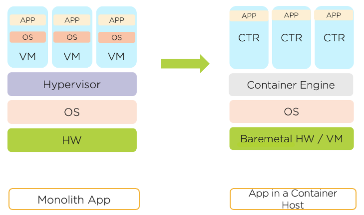

.. _docker_start:

-----------------------------
Containerizing the Fiesta App
-----------------------------

Containers are a standardized means of packaging software that include code and all its dependencies into an image, which allows an application to be reliably portable from one environment to another. The images run on an engine, such as Docker, which allows you to run multiple containers on the same host operating system while being completely isolated from one another.

In this section, you will learn how to convert the VM-based Fiesta web server into a containerized service running on your Docker VM. You will then test the application by deploying the container.
..
   .. note::

      Estimated time **30 minutes**

Analyzing The Legacy Application
++++++++++++++++++++++++++++++++

Let's begin by reviewing the Blueprint to better understand how the installation and operation of the legacy, VM based Fiesta deployment.

#. In **Prism Central**, select :fa:`bars` **> Services > Calm**.

#. From the left-hand toolbar in **Calm**, click the |bp_icon| **Blueprints** icon.

#. Open the **Docker_MariaDB_FiestaApp_ERA** blueprint.

#. Click on the **Fiesta_App_VM** VM, then from the right-hand pane, click on **Package > Configure Install**.

   .. figure:: images/1b.png

   Observe that the installation of this service consists of three serial tasks.

#. Select **Install npm**, and maximize the **Script** section in the right-hand pane. The script performs the following steps:

   - Install required packages, including NodeJS
   - Clones a Git repository containing the Fiesta app source
   - Builds the Fiesta application using the Node Package Manager (npm)

   .. figure:: images/2b.png

.. _basic_container:

Building Your First Container
+++++++++++++++++++++++++++++

In this section, you will build your initial container.

   - The building of this container will be created from the settings within our **dockerfile**. A **dockerfile** is a text document that contains all the commands a user could call on the command line to assemble the Docker image. Docker can build images automatically by reading the instructions from a **dockerfile**.

   - A **Docker image** is a read-only template that contains a set of instructions for creating a container that can run on the Docker platform.

   - Using ``docker build`` users can create an automated build that executes several command-line instructions in succession.

Here's a quick way to visualize these terms, and the overall process. As you can see in the below diagram, when the **dockerfile** is built, it becomes a **Docker Image**. When we run the **Docker Image**, it becomes a **Docker container**.

.. figure:: images/2a.png

.. note::

   Disk space is a consideration when building any container, and as such, we are using Alpine Linux. Alpine Linux is a Linux distribution designed for security, simplicity, and resource efficiency.

#. In **Prism Central**, select :fa:`bars` **> Infrastructure > VMs**.

#. Search for your **User**\ *##*\ **-docker_VM** VM and note its IP Address.

#. Connect to your **User**\ *##*\ **-docker_VM** VM via SSH using the following credentials:

   - **Username** - root
   - **Password** - nutanix/4u

#. Run ``mkdir github``, followed by ``cd github``.

   This will create, and change to the directory we will be using to store the Fiesta repository.

#. Run ``git clone https://github.com/sharonpamela/Fiesta`` to make a local copy of the Fiesta repository in the **github** directory.

#. Run ``vi dockerfile`` to create the blank **dockerfile** and edit with the **vi** text editor.

   .. note::

      You can alternatively use nano, or any other text editor with which you are comfortable.

#. Press either the **i** or **Insert** key to begin inserting text into the **dockerfile** file.

#. Copy and paste the following:

   .. code-block:: dockerfile

      # Grab the needed OS image
      FROM wessenstam/ntnx-alpine:latest

      # Install the needed packages
      RUN apk add --no-cache --update nodejs npm mysql-client git python3 python3-dev gcc g++ unixodbc-dev curl

      # Create a location in the container for the Fiest Application Code
      RUN mkdir /code

      # Make sure that all next commands are run against the /code directory
      WORKDIR /code

      # Copy needed files into the container
      COPY runapp.sh /code

      # Make the runapp.sh executable
      RUN chmod +x /code/runapp.sh

      # Start the application
      ENTRYPOINT [ "/code/runapp.sh"]

      # Expose port 3001 and 3000 to the outside world
      EXPOSE 3001 3000

   .. note::

      If using **PuTTY** as your SSH client in Windows, you can paste into **vi** by right-clicking inside of the SSH session window.

#. Press the **ESC** key to stop editing the file.

#. Save the file and exit the editor by pressing ``:wq!`` followed by the **Return** key.

#. Create a file called **runapp.sh** by running ``vi runapp.sh``.

#. Press either the **i** or **Insert** key to begin inserting text into the **runapp.sh** file.

#. Copy and paste the following:

   .. note::

      You must replace **<MARIADB-IP-ADDRESS>** to match your **USER**\ *##*\ **-MariaDB_VM** IP address. If you are uncomfortable with using **vi**, you can paste the contents into Notepad or another GUI-based text editor and update the value with the correct IP *before* pasting into **vi**.

   .. figure:: images/dbip.png

   .. code-block:: bash

      #!/bin/sh

      # Clone the Repo into the container in the /code folder we already created in the dockerfile
      git clone https://github.com/sharonpamela/Fiesta /code/Fiesta

      # Change the configuration from the git clone action
      sed -i 's/REPLACE_DB_NAME/FiestaDB/g' /code/Fiesta/config/config.js
      sed -i "s/REPLACE_DB_HOST_ADDRESS/<MARIADB-IP-ADDRESS>/g" /code/Fiesta/config/config.js
      sed -i "s/REPLACE_DB_DIALECT/mysql/g" /code/Fiesta/config/config.js
      sed -i "s/REPLACE_DB_USER_NAME/fiesta/g" /code/Fiesta/config/config.js
      sed -i "s/REPLACE_DB_PASSWORD/fiesta/g" /code/Fiesta/config/config.js

      npm install -g nodemon

      # Get ready to start the application
      cd /code/Fiesta
      npm install
      cd /code/Fiesta/client
      npm install

      # Build the app
      npm run build

      # Run the NPM Application
      cd /code/Fiesta
      npm start

#. Press the **ESC** key to stop editing the file.

#. Save the file and exit the editor by pressing ``:wq!`` followed by the **Return** key.

   .. note::

      As a general best practice, you would never put static information such as a database IP address inside of a container image. This type of information should be passed in as a variable in order to make your container portable. This will be addressed later.

#. Run ``ls -al`` to perform a directory listing.

   Ensure your **github** directory looks like the below before proceeding.

   .. figure:: images/5.png

#. Run ``docker login`` and provide the credentials for your Docker Hub account created during :ref:`environment_start`.

#. Run ``docker build .`` (including the period) to create the container.

   This should take approximately 1 minute to complete.

   .. note::

       If you get an error message stating **You have reached your pull limit...**, ask for support in Slack.

#. Run ``docker image ls`` to list your images.

   You should observe two separate images. The **ntnx-alpine** image is the container OS you defined within your **Dockerfile**, and the unidentified container is the Fiesta service you've defined in this exercise.

   .. figure:: images/6.png

   We can easily add some additional context to make the image easier to identify.

#. Run ``docker build . -t fiesta_app:1.0``

   This will change the existing *Repository* to **fiesta_app**, and the **tag** to **1.0**.

   .. #. Rerun ``docker build . -t fiesta_app:1.0`` . This will tag the existing image **<none>** to be called **fiesta_app** with version number **1.0**

#. Rerun ``docker image ls`` to show the list of images in your docker environment.

   .. figure:: images/7.png

#. Run ``docker run -d --rm --name Fiesta_App fiesta_app:1.0`` to create the container.

   .. note::

      - ``--name`` give the container a name, as by default the name will be randomly generated. This makes the management of the container easier.

      - ``--rm`` Remove the container after it stops.

      - ``-d`` Run as a daemon (a background process that handles requests, but is dormant when not required).

#. Run ``docker logs --follow Fiesta_App`` to see the console log of the container.

   After approximately 2-3 minutes, the application will be started, and you will see something like the below.

   .. figure:: images/8.png

   While the application is running, you won't get a response if you visit the URL referenced in the screenshot. This is because the IP address listed is internal to the Docker environment. To correct this, we must configure the docker engine to allow external traffic to reach port 3000.

#. Press **CTRL+C** to exit the ``docker logs`` command, and return to the command prompt.

#. Run ``docker stop Fiesta_App``

   This will both stop and delete the container, as specified by the ``--rm`` switch when creating the container.

   ..
   [We need a pause here. I've tried this multiple times, and if I do these without waiting I get an the error: docker: Error response from daemon: Conflict. The container name "/Fiesta_App" is already in use by container "f838ddea0f8920fde1136bb722fd97fde6605871fd3813068f0e371cf79c6e28". You have to remove (or rename) that container to be able to reuse that name.]

#. Run ``docker run -d --rm -p 5000:3000 --name Fiesta_App fiesta_app:1.0``

   The ``-p 5000:3000`` parameter exposes port 5000, and maps external port 5000 to internal port 3000.

#. Run ``docker logs --follow Fiesta_App`` again.

   Once the application is running, you should be able to access the web interface by opening a browser to  \http://*<User##-docker_VM-IP-ADDRESS>*:5000/products

   .. figure:: images/9.png

#. Run ``docker stop Fiesta_App`` as we don't need it running for now.

.. raw:: html

    <H1>
Congratulations!
</H1>

You have just created your initial version of the Fiesta app as a container. However, fully re-architecting an application isn't that easy! We still need to address the following questions:

   - What additional tools can make developing and deploying easier and faster?

   - How can we dynamically build the environment based on external variables?

   - How do we enable others to use the container image we have created?

.. |proj-icon| image:: ../images/projects_icon.png
.. |bp_icon| image:: ../images/blueprints_icon.png
.. |mktmgr-icon| image:: ../images/marketplacemanager_icon.png
.. |mkt-icon| image:: ../images/marketplace_icon.png
.. |bp-icon| image:: ../images/blueprints_icon.png
